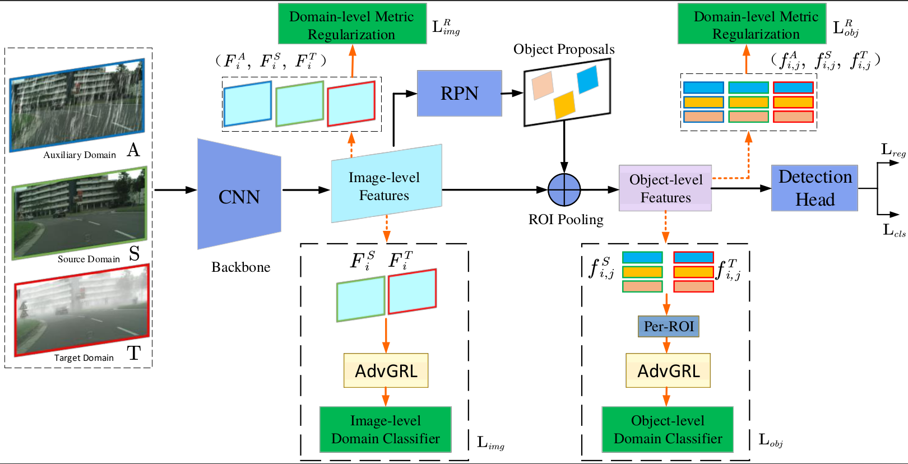
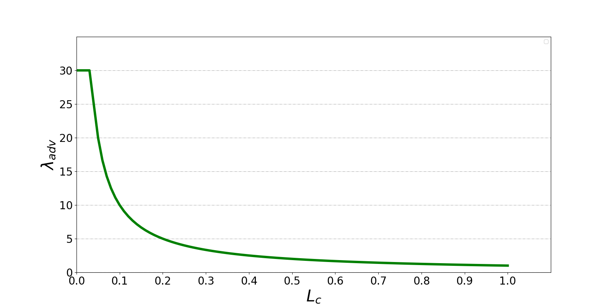

<!--
 * @Descripttion: 
 * @version: 
 * @Author: Jinlong Li CSU PhD
 * @Date: 2021-10-15 17:13:40
 * @LastEditors: Jinlong Li CSU PhD
 * @LastEditTime: 2023-02-23 11:47:54
-->
# [DA-Detect](https://arxiv.org/abs/2210.15176): Domain Adaptive Object Detection for Autonomous Driving under Foggy Weather (WACV 2023)


[](https://arxiv.org/abs/2210.15176)
[](https://opensource.org/licenses/MIT) 
<!-- []() -->
<!-- []() -->


<<<<<<< HEAD
This is a PyTorch implementation of 'Domain Adaptive Object Detection for Autonomous Driving under Foggy Weather', implementedby [jinlong Li](https://jinlong17.github.io/). Which is modified from the original code [Domain-Adaptive-Faster-RCNN-PyTorch](https://github.com/krumo/Domain-Adaptive-Faster-RCNN-PyTorch) implementated by Haoran Wang(whrzxzero@gmail.com). The original paper is [Domain adaptive faster r-cnn for object detection in the wild](https://arxiv.org/pdf/1803.03243.pdf), this implementation is built on [maskrcnn-benchmark](https://github.com/facebookresearch/maskrcnn-benchmark) @ [e60f4ec](https://github.com/facebookresearch/maskrcnn-benchmark/tree/e60f4ec8dc50531debcfd5ae671ea167b5b7a1d9).
=======
This is a PyTorch implementation of 'Domain Adaptive Object Detection for Autonomous Driving under Foggy Weather', implemented by [jinlong Li](https://jinlong17.github.io/). Wcich is modified from the original code [Domain-Adaptive-Faster-RCNN-PyTorch](https://github.com/krumo/Domain-Adaptive-Faster-RCNN-PyTorch) implementated by Haoran Wang(whrzxzero@gmail.com). The original paper is [Domain adaptive faster r-cnn for object detection in the wild](https://arxiv.org/pdf/1803.03243.pdf), this implementation is built on [maskrcnn-benchmark](https://github.com/facebookresearch/maskrcnn-benchmark) @ [e60f4ec](https://github.com/facebookresearch/maskrcnn-benchmark/tree/e60f4ec8dc50531debcfd5ae671ea167b5b7a1d9).
>>>>>>> add the learnable margin in triple loss



## Installation

Please follow the instruction in [maskrcnn-benchmark](https://github.com/facebookresearch/maskrcnn-benchmark) to install it, the detail as follows:

* Clone this repository on your PC;
  ```bash
  git clone https://github.com/jinlong17/DA-Detect
  ```
* Come into the cloned repository, the following the [INSTALLATION](https://github.com/facebookresearch/maskrcnn-benchmark/blob/main/INSTALL.md), like (Linux as an example):
    ```bash
    # first, make sure that your conda is setup properly with the right environment for that, check that `which conda`, `which pip` and `which python` points to the right path. From a clean conda env, this is what you need to do
    conda create --name maskrcnn_benchmark -y
    conda activate maskrcnn_benchmark
    # this installs the right pip and dependencies for the fresh python
    conda install ipython pip
    # maskrcnn_benchmark and coco api dependencies
    pip install ninja yacs cython matplotlib tqdm opencv-python
    # follow PyTorch installation in https://pytorch.org/get-started/locally/
    # we give the instructions for CUDA 9.0
    conda install -c pytorch pytorch-nightly torchvision cudatoolkit=9.0
    export INSTALL_DIR=$PWD
    # install pycocotools
    cd $INSTALL_DIR
    git clone https://github.com/cocodataset/cocoapi.git
    cd cocoapi/PythonAPI
    python setup.py build_ext install
    # install cityscapesScripts
    cd $INSTALL_DIR
    git clone https://github.com/mcordts/cityscapesScripts.git
    cd cityscapesScripts/
    python setup.py build_ext install
    # install apex
    cd $INSTALL_DIR
    git clone https://github.com/NVIDIA/apex.git
    cd apex
    python setup.py install --cuda_ext --cpp_ext
    # install PyTorch Detection
    cd $INSTALL_DIR
    git clone https://github.com/facebookresearch/maskrcnn-benchmark.git
    cd maskrcnn-benchmark
    # the following will install the lib with
    # symbolic links, so that you can modify
    # the files if you want and won't need to
    # re-build it
    python setup.py build develop
    unset INSTALL_DIR
    # or if you are on macOS
    # MACOSX_DEPLOYMENT_TARGET=10.9 CC=clang CXX=clang++ python setup.py build develop
    ```
---
## Data

1. Download the dataset;
     * **Source domain**:  leftImg8bit_trainvaltest in [Cityscapes Dataset](https://www.cityscapes-dataset.com/downloads/)
     * **Target domain**: leftImg8bit_trainvaltest_foggy in [Foggy Cityscapes Dataset](https://www.cityscapes-dataset.com/downloads/);
     * **Auxiliary domain** (**being ready**): for a domain-level metric regularization (use for Triplet loss): [Rainy Cityscape Dataset](): 
2. Follow the example in [Detectron-DA-Faster-RCNN](https://github.com/krumo/Detectron-DA-Faster-RCNN) to generate coco style annoation files (**Cityscapes Dataset** and **Foggy Cityscapes Dataset**)


## Getting Started
An example of Domain Adaptive Faster R-CNN using triplet loss with ResNet adapting from **Cityscapes** dataset to **Foggy Cityscapes** dataset is provided:
1. Follow the example in [Detectron-DA-Faster-RCNN](https://github.com/krumo/Detectron-DA-Faster-RCNN) to generate coco style annoation files
2. Modified the dataset path to the Cityscapes and Foggy Cityscapes dataset and Rainy Cityscapes dataset in `paths_catalog.py`, which is like:
    ```bash
    "foggy_cityscapes_fine_instanceonly_seg_train_cocostyle":{
        "img_dir": "your data path",
        "ann_file": "your data path" 
    }
    "foggy_cityscapes_fine_instanceonly_seg_val_cocostyle":{
        "img_dir": "your data path",
        "ann_file": "your data  path" 
    }
    ```
3. Modified the yaml file in `configs/da_faster_rcnn`, use `e2e_triplet_da_faster_rcnn_R_50_C4_cityscapes_to_foggy_cityscapes.yaml` as an example:
   ```bash
    
    MODEL:
        OUTPUT_DIR: #your training model saving path
        OUTPUT_SAVE_NAME: # your training model saving folder name
    DA_HEADS:
        DA_ADV_GRL: # True or False, using AdvGRL or GRL
        ALIGNMENT: # True or False,  True is for aligned synthetic dataset training like: Cityscapes dataset, Foggy Cityscapes dataset, and Rainy Cityscapes dataset. False is for cross-camera training.
        TRIPLET_MARGIN: # the margin of triplet loss 
    ```
4. Train the Domain Adaptive Faster R-CNN:
    ```
    python3 tools/train_net.py --config-file "configs/da_faster_rcnn/e2e_triplet_da_faster_rcnn_R_50_C4_cityscapes_to_foggy_cityscapes.yaml"
    ```
5. Test the trained model:
    ```
    python3 tools/test_net.py --config-file "configs/da_faster_rcnn/e2e_triplet_da_faster_rcnn_R_50_C4_cityscapes_to_foggy_cityscapes.yaml" MODEL.WEIGHT <path_to_store_weight>/model_final.pth
    ```

## Proposed Component

### Adversarial Gradient Reversal Layer (**AdvGRL**)
Illustration of the adversarial mining for hard training examples by the proposed AdvGRL. In this example, we set $\lambda_0$ = 1, $\beta$ = 30. Harder training examples with lower domain classifier loss $L_c$ will have larger response. The function `Adv_GRL()` can be in file `modeling/da_heads.py`. 



### Domain-level Metric Regularization (Based on Triplet Loss)

Previous existing domain adaptation methods mainly focus on the transfer learning from source domain $S$ to target domain $T$, which neglects the potential benefits of the third related domain can bring. To address this and thus additionally involve the feature metric constraint between different domains, we proposed an auxiliary domain for a domain-level metric regularization during the transfer learning. The function `Domainlevel_Img_component()`and `Domainlevel_Ins_component()` can be found in file `modeling/da_heads.py`.


## Ablation Study Results
The following results are conducted with the same RestNet-50 backbone on the Cityscapes -> Foggy Cityscapes experiment.

|                                | Image-level  | Object-level    |    AdvGRL    | Regularization | AP@50       | Download |
|--------------------------------|:------------:|:---------------:|:------------:|:--------------:|:-----------:|:........:|
| Faster R-CNN (source only)     |              |                 |              |                |   23.41     |          |         
| DA Faster (Img+GRL)            |          ✓   |                 |              |                |   38.10     |          | 
| DA Faster (Obj+GRL)            |              |          ✓      |              |                |   38.02     |          |
| DA Faster (Img+Obj+GRL)        |          ✓   |          ✓      |              |                |   38.43     |          | 
| DA Faster (Img+Obj+AdvGRL)     |          ✓   |          ✓      |          ✓   |                |   40.23     |          |
| DA Faster (Img+Obj+GRL+Reg)    |          ✓   |          ✓      |              |        ✓       |   41.97     |          |
| DA Faster (Img+Obj+AdvGRL+Reg) |          ✓   |          ✓      |          ✓   |        ✓       |   42.34     |          |


## Citation
 If you are using our proposed method for your research, please cite the following paper:
 ```bibtex
@inproceedings{li2023domain,
  title={Domain Adaptive Object Detection for Autonomous Driving under Foggy Weather},
  author={Li, Jinlong and Xu, Runsheng and Ma, Jin and Zou, Qin and Ma, Jiaqi and Yu, Hongkai},
  booktitle={Proceedings of the IEEE/CVF Winter Conference on Applications of Computer Vision},
  pages={612--622},
  year={2023}
}
```
If you find this repository useful, please cite the oringinal paper:

```
@inproceedings{chen2018domain,
  title={Domain Adaptive Faster R-CNN for Object Detection in the Wild},
      author =     {Chen, Yuhua and Li, Wen and Sakaridis, Christos and Dai, Dengxin and Van Gool, Luc},
      booktitle =  {Computer Vision and Pattern Recognition (CVPR)},
      year =       {2018}
  }
```
and maskrnn-benchmark:

```
@misc{massa2018mrcnn,
author = {Massa, Francisco and Girshick, Ross},
title = {{maskrnn-benchmark: Fast, modular reference implementation of Instance Segmentation and Object Detection algorithms in PyTorch}},
year = {2018},
howpublished = {\url{https://github.com/facebookresearch/maskrcnn-benchmark}},
note = {Accessed: [Insert date here]}
}
```

## Acknowledgment
 This code is modified based on the original code [Domain-Adaptive-Faster-RCNN-PyTorch](https://github.com/krumo/Domain-Adaptive-Faster-RCNN-PyTorch) and [maskrcnn-benchmark](https://github.com/facebookresearch/maskrcnn-benchmark). Thanks.


